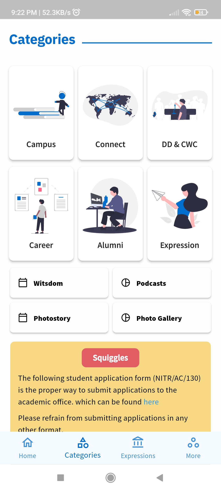

  

  <h3 align="center">Monday Morning</h3>

  

    The Official Student Media Body of <a href="https://nitrkl.ac.in">NIT Rourkela</a>
     
     
		<a href="https://play.google.com/store/apps/details?id=in.ac.nitrkl.mondaymorning">View Live</a>
    •
    <a href="https://github.com/Monday-Morning/project-pegasus/issues">View Issues</a>
    •
    <a href="https://github.com/Monday-Morning/project-pegasus/issues/new?assignees=&labels=bug&template=bug_report.md&title=bug%3A+">Report Bugs</a>
    •
    <a href="https://github.com/Monday-Morning/project-pegasus/issues/new?assignees=&labels=enhancement&template=feature_request.md&title=enhancement%3A+">Suggest Features</a>
  

	<h4 align="center">Project Overview</h4>

  

			
			
			
			
	

<!-- TABLE OF CONTENTS -->

  
Table of Contents

  <ol>
    <li><a href="#about-monday-morning">About Monday Morning</a></li>
    <li><a href="#about-the-project">About the Project</a></li>
    <li><a href="#built-with">Built With</a></li>
    <li>
      <a href="#getting-started">Getting Started</a>
      <ul>
        <li><a href="#contribution-guidlines">Contribution guidlines</a></li>
        <li><a href="#local-repository-setup">Local Repository Setup</a></li>
        <li><a href="#running-the-project">Running the project</a></li>
      </ul>
    </li>
    <li><a href="#license">License</a></li>
    <!-- <li><a href="#contributors">Contributors</a></li> -->
  </ol>

## About Monday Morning

[![Monday Morning][repo-cover]](https://mondaymorning.nitrkl.ac.in)

Monday Morning is the student media body of National Institute of Technology, Rourkela. Since its inception in 2006, it has constantly served as a vital link between the student community and the administration. The weekly e-newsletter serves as a news feed for the students, professors and alumni of the institute, featuring campus activities, department updates, recruitment information, SAC happenings, alumni news, weekly polls and interviews of the Director, Chief Warden, professors, distinguished alumni and dignitaries and exceptional students. Apart from the online weekly edition, Monday Morning also publishes print editions and organises the Open House Discussion.

## About the Project

  
  
  
  
  

Project Infinity is about updating the Monday Morning website using modern technologies which is divided accross 3 main sub-projects.

1. [project-tahiti](https://github.com/Monday-Morning/project-tahiti): The Client side application of the website.
1. [project-reclamation](https://github.com/Monday-Morning/project-reclamation): The Server application of the website.
1. [project-pegasus](https://github.com/Monday-Morning/project-pegasus): The cross-platform Mobile application of the Monday Morning.

## Built With

Following technologies and libraries are used for the development of this website

- [Dart](https://dart.dev/)
- [Flutter](https://flutter.dev/)
- [Riverpod](https://riverpod.dev/)
- [Firebase](https://firebase.google.com/)
- [GraphQL](https://graphql.org/)
- [Apollo Client](https://www.apollographql.com/docs/react/)

## Getting Started

To setup the project locally follow the steps below.

### Contribution guidlines 🎃

NOTE 1: Please abide by the [Contributing Guidelines](https://github.com/Monday-Morning/project-pegasus/blob/master/CONTRIBUTING.md).

NOTE 2: Please abide by the [Code of Conduct](https://github.com/Monday-Morning/project-pegasus/blob/master/CODE_OF_CONDUCT.md).

### Local Repository Setup

Please refer to the project's style and contribution guidelines for submitting patches and additions. In general, we follow the "fork-and-pull" Git workflow.

1.  **Fork** the repo on GitHub
2.  **Clone** the project to your local system
3.  **Commit** changes to your own separate branch
4.  **Push** your work back up to your fork
5.  Submit a **Pull request** so that we can review your changes

### Running the project.

1. **Install Flutter on your machine**

    Install flutter by selecting the operating system on which you are installing Flutter: [Flutter installation tutorial](https://flutter.dev/docs/get-started/install)

    To check if you have flutter installed along wtih proper necesarry SDKs installed
    run `flutter doctor`

2. **Fork and Clone the Repo**

    Fork the repo by clicking on the **Fork** button on the top right corner of the page.
    To clone this repository, run `git clone https://github.com/Monday-Morning/project-pegasus.git`
    Then run `cd app`

3. **Get Packages**

     Make sure you are in the `project-pegasus/app` directory

    - From the terminal: Run `flutter pub get`.
      _OR_
    - From Android Studio/IntelliJ: **Click Packages get** in the action ribbon at the top of `pubspec.yaml`.
    - From VS Code: **Click Get Packages** located in right side of the action ribbon at the top of `pubspec.yaml`.

### Run the App

  On terminal:

- Check that an Android device is running by running `flutter devices`. If none are shown, follow the device-specific instructions on the [Install](https://flutter.dev/docs/get-started/install) page for your OS.
- Run the app with the following command: `flutter run`
.

## License

Distributed under the MIT License. See [`License`](license-url) for more information.

<!-- MARKDOWN LINKS & IMAGES -->
<!-- https://www.markdownguide.org/basic-syntax/#reference-style-links -->

